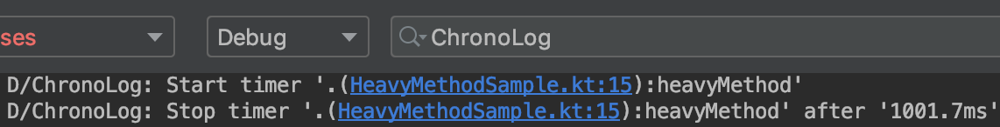

# Chrono


Android library for measuring time intervals and tracing methods.

## How to integrate

```groovy
implementation 'io.github.acelost:chrono:0.0.5'
```

## How to use
To measure execution time just wrap your code by class `Timer`:
 
```java
void heavyMethod() {
    Timer timer = Timer.startNew();
    Thread.sleep(1000);
    timer.stop();
}
```
You can see `Chrono` output in logcat by tag `ChronoLog` with debug level:



By default the timer named with link to file and method name where you created it, but you can set name explicitly:

```java
void heavyMethod() {
    Timer timer = Timer.startNew("heavy-method");
    ...
```


Also you can trace any point in your code by method `capture`:

```java
void heavyMethod() {
    Timer timer = Timer.startNew("heavy-method");
    Thread.sleep(1000);
    timer.capture("after a long sleep");
    Thread.sleep(300);
    timer.capture("after a quick sleep");
    Thread.sleep(500);
    timer.stop();
}
```


If you want to trace code over several classes you can use `Chrono` as static storage of your timer with access by key. Dont worry, `Timer` is thread safe!

```java
class DummyActivity extends AppCompatActivity {
    
    public void onCreate(Bundle savedInstanceState) {
        super.onCreate(savedInstanceState);
        Chrono.start("transaction");
        FragmentTransaction transaction = getSupportFragmentManager()
                .beginTransaction()
                .add(R.id.fragment_container, new DummyFragment());
        Chrono.capture("transaction", "transaction ready");
        transaction.commit();
    }
    
}

class DummyFragment extends Fragment {
    
    public void onCreate(Bundle savedInstanceState) {
        Chrono.capture("transaction", "fragment on create");
        super.onCreate(savedInstanceState);
    }
    
    public void onResume() {
        super.onResume();
        Chrono.capture("transaction", "fragment is visible");
        Chrono.stop("transaction");
    }
    
}
```


## License

    Copyright 2019 The Spectrum Author

    Licensed under the Apache License, Version 2.0 (the "License");
    you may not use this file except in compliance with the License.
    You may obtain a copy of the License at

       http://www.apache.org/licenses/LICENSE-2.0

    Unless required by applicable law or agreed to in writing, software
    distributed under the License is distributed on an "AS IS" BASIS,
    WITHOUT WARRANTIES OR CONDITIONS OF ANY KIND, either express or implied.
    See the License for the specific language governing permissions and
    limitations under the License.